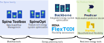

# Overview

## Open energy system models are fueling the green energy transition

Our mission is to research new methodology and develop demonstration-ready energy modelling tools, that allow for maximum flexibility, generality and speed while being open, secure and user-friendly. This is no easy task, but to pride ourselves by saying that our tools are at the cutting edge of the field. We do this by simultanously hosting many modelling tools and research projects with similar goals, yet different focuses - and by working in close collaboration with the leading open-source energy models out there, like our friends at PyPSA and Osemosys. Of course we also work hand-in-hand with other VTT energy models, like Fleximar.

There are many open energy system models and modelling frameworks out there. We appreciate you taking the time and patience to get to know our tools, and hope they can help you in solving the novel energy system challenges of your case. Please read through our leading ideas in model design below, install our models and try them out. We do our best to provide tutorials and documentation, but please excuse when we fail to be clear and let us know on our mistakes so we can work on fixing them.

## Overall view of our tools

