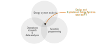

# The Design and Operation of Energy Systems Team at VTT - who are we?

*'Design and Operation of Energy Systems' team at VTT Finland is developing state-of-the-art open optimization models for 100% sustainable energy systems*

We operate at the sweet spot between where energy system expertize meets mathematics and programming. Our team consist of nine researchers with years of experience on creating cutting-edge energy system modelling. Our work is in research projects for the benefit of the Finnish and European public authorities, as well as the Nordic industry.

 Here are some of our largest ongoing projects:

- Mopo
- ELEXIA
- ...

Some of our reference work includes:

- Nordic energy system model for Backbone
- ...

For full list of our ongoing and past projects, please visit: LINK TO PURE

Want to know more? Contact us at [does-info@vtt.fi](mailto:does-info@vtt.fi)
