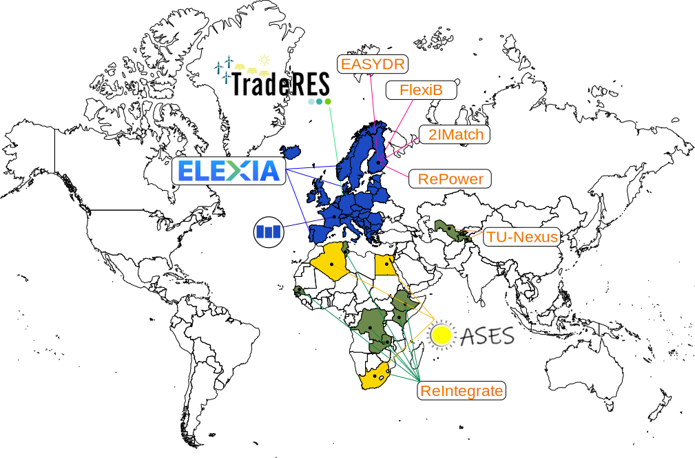
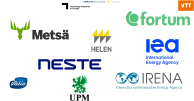

# The Design and Operation of Energy Systems Team at VTT 
## who are we?

*'Design and Operation of Energy Systems' team at VTT Finland is developing state-of-the-art open optimization models for 100% sustainable energy systems*

We operate at the sweet spot between where energy system expertize meets mathematics and programming. Our team consist of nine researchers with years of experience on creating cutting-edge energy system modelling. Our work is in research projects for the benefit of the Finnish and European public authorities, as well as the Nordic industry.

## Our current research project
 Here are some of our largest ongoing research projects:

Some of our reference work includes:

### 2IMatch
Strategic Research funding on the Just Energy Transition where our team is looking into the integration of energy grids through the different layers of the energy system, from local energy grids to the national network (when applied). It also assesses the different enegry and carbon policy and their impact on the energy market to promote a just energy transition (find out more about the [2IMatch](https://www.aka.fi/en/strategic-research/strategic-research/strategic-research-in-a-nutshell/programmes-and-projects/just-energy/2imatch/) project) 

### EasyDR
Enabling demand response through easy to use open source approach (EasyDR) is a research project where we are developping an affordable and open source energy management system for homes. It utilises the power of our VTT tool Predicer (see more in our tools lists) to manage and plan the utilisation of energy on different markets (heat & power but can accomodate other energy such as natural gas). Ultimately, the product will be accessible through the [home assistant](https://www.home-assistant.io)  interface and run on a raspberry pie.
(find out more about the [EasyDR](https://cris.vtt.fi/en/projects/enabling-demand-response-through-easy-to-use-open-source-approach) project)

### Elexia
The [Elexia](https://www.elexia-project.eu) focuses on the development of the energy system towards more digitalisation, in this project, we are continuing the development of operational tools and planning tools to 3 different pilot sites. The project will provide a standardised digital service platform where data can be brokered and unified through multiple software/model and smart gateways deployed on the fields. 

### FlexiB

### Mopo

### OASES

### ReIntegrate

### RePower

### TradeRES

### TU-Nexus

## References

## List of publications
For full list of our ongoing and past projects, please visit: [publication in VTT](https://cris.vtt.fi/en/organisations/ba4206-design-and-operation-of-energy-systems/publications/)

## Contact Us
Want to know more? Contact us at [does-info@vtt.fi](mailto:does-info@vtt.fi)
