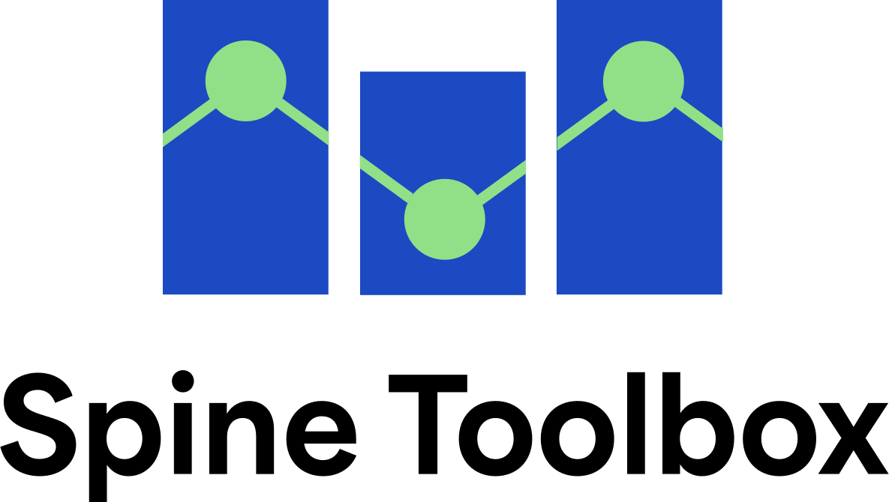

# Listing of our tools

## <u>Spine Toolbox</u> 

1. Graphical user interface for maintaining repeatable workflows from input data to different modelling tools and visualizing results
2. Tools to transform data, data structures, and data formats
3. Create scenarios from alternative values and parallelize the execution
4. Easy to share workflows and operate models without touching the code

Maturity score: ★★★☆☆ 
Availability score: ★★★★☆ 
Ease of use: ★★★☆☆ 
Level of flexibility: ★★★★★ 
Level of features: ★★★★☆

## <u>SpineOpt</u>

1. Fully open framework for energy system optimization models from site-level to continental-scale
2. Include operational detail in investment planning
3. Highly flexible temporal, spatial and stochastic settings
4. Written in Julia, use Spine Toolbox as user interface

\+ SpineInterface package for quick model building using Julia JuMP

Maturity score: ★★★☆☆ 
Availability score: ★★★★☆ 
Ease of use: ★★☆☆☆
Level of flexibility: ★★★★★ 
Level of features: ★★★★☆ 

## <u>Backbone</u>

1. Flexible and mature framework for energy system optimization models
2. Optimize investments and operation in multi-sectoral energy systems on local, national and continental scales
3. General in formulation, rich in features
4. Written in GAMS, no specific user interface (Excel+GDXXRW can be used), needs GAMS licence

Maturity score: ★★★★☆ 
Availability score: ★★★☆☆
Ease of use: ★★☆☆☆
Level of flexibility: ★★★★☆
Level of features: ★★★★★

https://gitlab.vtt.fi/backbone/backbone

## <u>IRENA FlexTool</u>

1. Fully open framework for energy system optimization models
2. Focused on system planning for high shares of variable power generation in future energy systems
3. Developed with IRENA for ease-of-use fo users with limited modelling or coding experience
4. FlexTool 3 written in AMPL+Python, can be used with Spine Toolbox or web interface (FlexTool 2 in IRENA distribution in Excel)

FlexTool 3: Maturity score: ★★★☆☆ 
Availability score: ★★★★☆ 
Ease of use: ★★★★☆ 
Level of flexibility: ★★★★☆ 
Level of features: ★★★☆☆

FlexTool 3: https://github.com/irena-flextool FlexTool 2: https://www.irena.org/Energy-Transition/Planning/Flextool

## <u>Predicer</u>

1. "Predictive decider" - A fully open framework for real-time asset management on complex stocastic markets
2. Supports models to maximize the revenue from the operation of existing assets an industrial site, a building or an energy storage
3. Supports models to optimize the trading on multiple simultaneous energy markets while considering short-term uncertainty in weather, market prices and energy demand
4. Written in Julia

Maturity score: ★★☆☆☆ 
Availability score: ★★★★☆ 
Ease of use: ★☆☆☆☆ 
Level of flexibility: ★★★★☆ 
Level of features: ★★★☆☆

## Hertta

1. Predicer-based easy-to-use home energy asset optimization software
2. In development, not published yet
3. Written in Rust with interface to Julia

Maturity score: ★☆☆☆☆ 
Availability score: ☆☆☆☆☆ 
Ease of use: ☆☆☆☆☆ 
Level of flexibility: ☆☆☆☆☆ 
Level of features: ☆☆☆☆☆

(Not public yet)

## Our best ideas to steal

1. **Not everything in the model needs same resolution – not in space, not in time and not in probability.** Freedom to assign different resolution to different parts of the model makes it possible to create a TIMES-like economy model and a PLEXOS-type operational model with the same tool. As computational time is still a major issue on how wide and detailed we can make our models, being free to assign more resolution to the parts that matter expands modelling capabilities. In SpineOpt, the spatial, temporal and stochastic resolution can be freely assigned to different types of model.
2. Invest optimizing without operational detail is like painting with the lights off. All modellers know it’s difficult to include operation detail in investment planning, but we believe it’s absolutely crucial and we have spent a lot of time on it.
3. The model doesn’t have to care whether you model power, heat, gas or river systems. Agnostic and general representation of energy vectors allows for easy modelling of sectoral integration. When you want to model a new technology or a new sector, you don’t need to touch the model fundamentals. Of course most used constraints like power flow, heat transfer, hydrological inflow, and technologies are included in the framework for your convenience.
4. Optimizing subsystems leads to suboptimal solutions.
5. Maintain workflows, not models
6. Using alternatives makes scenario building simpler.
7. A modeller doesn’t have to be a coder.
8. Open source is a strength.
9. We like our models, but we are not the best at everything. So explore the open source models out there and combine the best in them.
